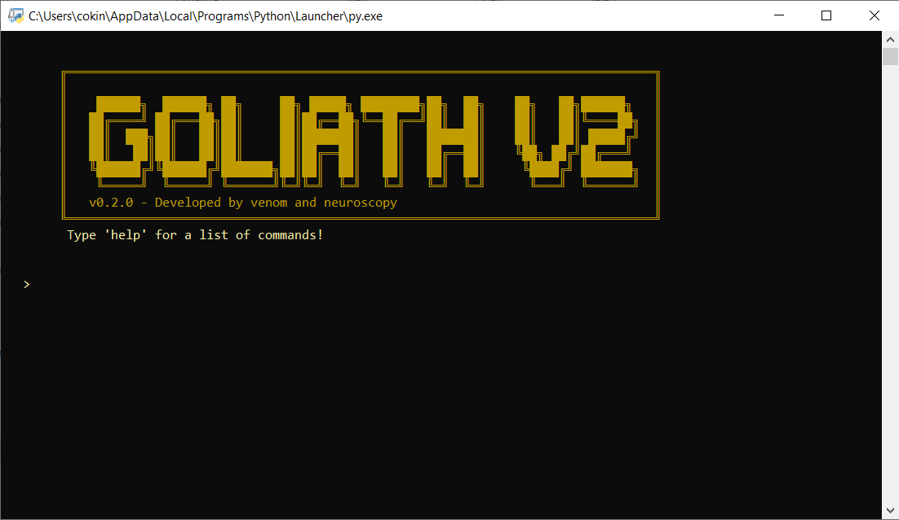

# - Goliath V2 -
Goliath V2 is the ultimate networking tool for all of your hacking needs. This is a bit of an older tool I made when I was slightly less experienced in python, hence why the UI isn't great and it says 'Made by Venom and Neuroscopy*' instead of just 'Made by Lunar Team.' Despite it's age, I believe it's still a great tool many people can benefit from.

Neuroscopy* - Neuroscopy is our member, soupcan7's old name. Neuroscopy and soupcan7 are the same people, and in a future update I will change that... whoopsie

# - Preview -


# - Commands -
    - scan: Scan a target IP for open ports.
    - info: Provides info on this program.
    - scangeo: Geolocates the target IP.
    - ping: Ping an IP to check if it is reachable.
    - publicip: Gets your local IP address.
    - traceroute: Perform a traceroute to an IP or domain.
    - dns: Perform a DNS lookup on a specified domain.
    - checkip: Check if the IP address is IPv4 or IPv6
    - hostname: Get the hostname for an IP address.
    - sysinfo: Display system information.
    - logip: Save information for an IP address.
    - readjson: Reads the logged IP data.
    - home: Clears the screen and goes back to the home screen.
    - exit: Exit GOLIATH V2.

# - Licences & Terms of Use
This project is licensed under the GNU General Public License v3.0
```js
Goliath V2 is made for educational purposes only and is not created for malicious purposes.
Any damage done with this software is not at the fault of Venom or at the fault of Lunar Team.
It is only at fault of the user.
```
